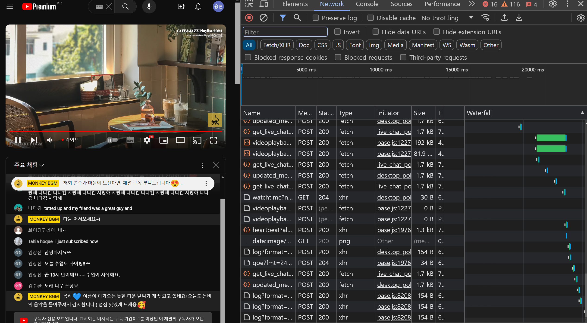

# `Error Handling`

---


페이지를 구성하는 요소 중 페이지에서 에러가 발생 했을 때 해당 에러를 캐치하여

**에러 상태를 렌더링 하고, 다음 로직을 실현 할 수 있게 하는 에러 컴포넌트를 구현 할 수 있습니다.**


이런식으로 말입니다.

`ErrorBoundary` 하위에 존재하는 `Page` 에서 런타임 에러가 발생하더라도 이는 `ErrorBondary` 상위까지 에러를 전파하지 않고

`ErrorBoundary` 컴포넌트에서 에러를 캐치하여 하위 영역에 `fallback` 에 전달된 컴포넌트를 렌더링 합니다.

`ErrorBoundary` 컴포넌트는 `React` 의 `ErrorBoundary Component` 를 이용합니다.

<a href = 'https://react.dev/reference/react/Component#catching-rendering-errors-with-an-error-boundary'>ErrorBoundary Component</a> 는 클래스형 컴포넌트를 이용하여 생명주기 메소드를 이용하는데

`ErrorBoundary Component` 는 다음과 같이 사용합니다.

```tsx
class ErrorBoundary extends React.Component {
  constructor(props) {
    super(props);
    this.state = { hasError: false };
  }

  static getDerivedStateFromError(error) {
    // Update state so the next render will show the fallback UI.
    return { hasError: true };
  }

  componentDidCatch(error, info) {
    // Example "componentStack":
    //   in ComponentThatThrows (created by App)
    //   in ErrorBoundary (created by App)
    //   in div (created by App)
    //   in App
    logErrorToMyService(error, info.componentStack);
  }

  render() {
    if (this.state.hasError) {
      // You can render any custom fallback UI
      return this.props.fallback;
    }

    return this.props.children;
  }
}
```

위 예시에서 `getDerivedStateFromError` 를 통해 하위 자식 노드에서 발생한 에러를 캐치하여 상태를 변경하고

에러가 존재한다면 `fallback` 에 해당하는 컴포넌트를 렌더링 하고 에러가 존재하지 않는다면 `children` 을 정상적으로 렌더링 합니다.

다음과 같이 `ErrorBoundary` 컴포넌트를 정의해둔 후 `fallback` 에 들어갈 에러 컴포넌트를 `error.js` 에 정의하여 사용 할 수 있습니다.

### `Error` 컴포넌트

---

```tsx
'use client';

export default function Error({
  error,
  reset,
}: {
  error: Error & { digest?: string };
  reset: () => void;
}) {
  return (
    <div>
      <h2>Something went wrong!</h2>
      <button onClick={() => reset()}>Try again</button>
    </div>
  );
}
```

`error.js` 에서 사용 할 컴포넌트는 우선 `use client` 로 정의해줘야 합니다.

`use client` 는 클라이언트 측의 상태를 캐치해야 하고 , 클라이언트 측에 사용 될 `DOM` 에 접근하여 `onClick` 메소드 등을 이용 할 것이기 때문에 `use client` 로 정의합니다.

즉, 클라이언트 측에서 발생할 상태를 캐치하여, 클라이언트 측에서 에러를 핸들링 할 것이기 때문에 `use client` 를 이용합니다.

> `use client`
> 기본적으로 `nextJS` 는 서버 측에서 정의된 서버 컴포넌트를 이용하여 `html` 파일을 빌드하고 빌드한 페이지를 클라이언트에게 제공합니다.
> 이를 통해 클라이언트 측에서 컴포넌트들이 로딩되어 `TTV` 시간이 느려지는 행위를 방지합니다.
> `use client` 로 정의된 컴포넌트가 없다면 클라이언트 측에서 호출되지 않습니다.
> 하지만 `use client` 로 정의된 컴포넌트가 있다면 서버 측에서 빌드 할 떄 호출되고 , 클라이언트 측에서도 다시 호출되어 `Actual DOM` 을 변경합니다.

`Error` 컴포넌트가 받는 `props` 인 `error, reset` 들은 다음과 같습니다.

#### `error`

`error` 는 자바스크립트의 `Error` 객체로 `name , message , stack` 등을 담은 에러 객체입니다.

에러 바운더리 하위에서 발생한 에러를 의미합니다.

`type` 선언을 살펴보면 `Error & { digest ?: string}` 으로 선언된 모습을 볼 수 있는데 `digest` 는 `NextJS` 에서 에러를 식별하기 위해 추가 할 수 있는 식별자 역할을 합니다.

#### `reset`

`reset` 함수는 클라이언트가 에러에서 회복하기 위해 시행 할 수 있는 메소드입니다.

해당 메소드가 실행되면 에러 바운더리 내부를 재호출하여 리렌더링을 야기합니다.

# `Global Error Handling`

---

만약 `app` 세그먼트에서 발생하는 에러를 핸들링 하고 싶다면 `global-error.js` 파일에 에러 바운더리 컴포넌트를 생성해주세요.

해당 컴포넌트는 최상단까지 전파된 에러를 캐치하여 에러 화면을 렌더링 합니다.

```tsx
'use client';

export default function GlobalError({
  error,
  reset,
}: {
  error: Error & { digest?: string };
  reset: () => void;
}) {
  return (
    <html>
      <body>
        <h2>Something went wrong!</h2>
        <button onClick={() => reset()}>Try again</button>
      </body>
    </html>
  );
}
```

`root segement` 를 대체할 에러 화면이기 때문에 필수적으로 `html , body` 태그가 필요 합니다.

> 기억합시다.
> 컴포넌트에서 발생한 에러는 상단 방향으로 에러가 버블업 됩니다.
> 그 중 가장 먼저 만나는 에러 바운더리 컴포넌트에 의해 에러가 캐치되고 에러가 핸들링 됩니다.

---

위에선 `ErrorHandling` 을 하기 위한 `ErrorBoundary` 를 배웠습니다.

그렇다면 이번엔 `Loading` 상태를 구현하기 위한 방법을 배워봅시다.

# `Loading UI and Streaming`

---

`NextJS` 에서 로딩 상태 구현을 위해선 두 가지 준비가 필요합니다.

1. `React.Suspense` 컴포넌트를 이용해 `fallback props` 에 로딩 시 렌더링 될 컴포넌틑 생성
2. `React.Suspense` 컴포넌트 하위 `children` 에 로딩을 야기 시킬 컴포넌트를 집어 넣음

`React.Suspense` 는 `children` 에서 `throw` 한 `Promise` 를 받아 `Promise` 가 `resolved` 되기 전 까지 `fallback` 에 존재하는 컴포넌트를 렌더링 하고

`resolved` 되면 `children` 에 있는 컴포넌트를 정상적으로 렌더링 합니다.

예를 들어

```tsx
<Suspense fallback={<p>Loading weather...</p>}>
  <Weather />
</Suspense>
```

다음 같은 구조에서 `Weather` 컴포넌트 내부에서 렌더링 시 `fetch()` 를 호출하여 `Promise` 객체를 `throw` 하면

> `Suspense` 내부의 `children` 들은 `useEffect` 에서 `Promise` 부르는 것이 아니라 렌더링시 부릅니다.
> `Suspense` 는 자동으로 `children` 의 `Promise` 객체를 캐치합니다.

`Promise` 의 진행 여부에 따라 `fallback , children` 중 알맞는 컴포넌트를 렌더링 합니다.

`Suspense` 하위에 존재하는 `children` 은 항상 `Promise` 가 `resolved` 된 후 받은 데이터를 이용하여 정상적인 렌더링이 가능합니다.

`fallback` 에 들어갈 컴포넌트는 `loading.js` 라는 파일 내부에서 정의해줍니다. 이런식으로요

```tsx
export default function Loading() {
  // You can add any UI inside Loading, including a Skeleton.
  return <LoadingSkeleton />;
}
```

### `Streaming with Suspense` ?

`Suspense` 컴포넌트를 이용하여 비동기 처리를 하는 것은 마치 `Streaming` 을 하는 것과 유사합니다.


실시간
`Streaming` 을 받아 시청하는 경우 개발자 도구의 네트워크 창을 살펴보세요.

스트리밍 서비스는 지속적으로 서버 측으로부터 `chunk` 로 이뤄진 비디오 데이터들을 받아 페이지에 렌더링 합니다.

```tsx
<Suspense fallback={<p>Loading weather...</p>}>
  <Weather />
</Suspense>
```

`Suspense` 를 이용한 비동기 처리는 마치 `Streaming` 처럼 데이터들을 요청하여 네트워크상에서 받아지는 순으로 렌더링을 가능하게 합니다.

위 코드를 살펴보면 사용자는 `<p>Loading .. </p>` 문서를 먼저 받아 렌더링 화면을 본 후

`Weather` 컴포넌트를 받아 재렌더링 된 화면을 보게 됩니다.

그렇다면 `NextJS` 는 왜 이런 방법을 택했을까요 ?


`NextJS` 로 `SSR` 을 구현한 페이지에서 사용자가 렌더링 된 화면을 받는 과정을 살펴봅시다.

위 예시에서 `NextJS` 는 사용자에게 페이지를 전달하기 전 필요한 데이터들을 미리 준비하는 `pre-fetch` 단계를 거쳐 데이터를 준비한다고 했습니다.

준비된 데이터를 이용해 정적 파일을 생성하는 `B` 단계를 거치고 정적 파일이 생성되었다면

우선 정적 파일을 클라이언트에게 전송하는 `C` 단계를 거칩니다.

`C` 단계를 거치고 나면 클라이언트 브라우저 상에는 정적인 `HTML` 파일이 렌더링 되어 `FCP` 단계가 빠르게 옵니다.

이 때 정적인 `HTML` 파일일 뿐, 인터렉티브한 행위는 불가능합니다.

아직 `use client` 로 정의된 리액트 컴포넌트들이 클라이언트 상에서 호출 되지 않았기 때문입니다.

> `use client` 로 정의된 컴포넌트는 서버 상에서 정적으로 렌더링 되어 페이지를 구성하고
> 클라이언트 상에서 다시 렌더링 되어 인터렉티브한 웹앱을 만듭니다.

이렇게 `use client` 로 생성된 컴포넌트가 클라이언트 상에서 다시 호출되는 것을 `hydrate` 되었다고 합니다.

클라이언트가 페이지에서 빠르게 렌더링 된 화면을 보기 위해선 위 단계에서 `A` 시간을 줄여야 합니다.

만약 `Suspense` 를 사용하지 않고 데이터가 준비 될 때 까지 기다릴 경우엔 `A` 시간은 길어지고 그로 인해 `FCP` 시간이 느려지게 됩니다.

이에 `NextJS` 는 `Suspense` 를 이용하여 정적인 파일을 먼저 빌드하고 , `FCP` 이후 비동기적으로 요청된 데이터들을 이용해 `re-rendering` 합니다.


마치 스트리밍 서비스처럼 정적 파일 렌더링 -> `hydrate` -> 비동기 처리-> 리렌더링 -> 비동기 처리 완료 -> 리렌더링 .. 과정을 거칩니다.


위에서 봤던 스트리밍 서비스의 네트워크 창처럼 모든 비동기처리가 완료되지 않았더라도

`TTI` 가 가능한 `D` 단계까지 빠르게 도달한 후, 추후 비동기 처리가 완료된 데이터를 렌더링 하여 최종적인 웹앱을 완성합니다.

최대한 빠르게 `FCP , TTI` 를 마쳐 클라이언트가 페이지를 보기 전까지의 시간을 낮추는 전략적인 방법입니다.

```tsx
import { Suspense } from 'react';
import { PostFeed, Weather } from './Components';

export default function Posts() {
  return (
    <section>
      <Suspense fallback={<p>Loading feed...</p>}>
        <PostFeed />
      </Suspense>
      <Suspense fallback={<p>Loading weather...</p>}>
        <Weather />
      </Suspense>
    </section>
  );
}
```

다음처럼 스트리밍과 유사한 방법으로 컴포넌트들을 구성해둘 수 있습니다.

그 뿐 아니라 `Suspense` 의 `children` 에 존재하는 컴포넌트의 비동기 요청이 `rejected` 되었을 때를 대비하여 `ErrorBoundary` 컴포넌트를 이용해 `wrapping` 해줄 수 있습니다.

```tsx
export default function Posts() {
  return (
    <section>
      <ErrorBoundary
        fallback={<p>Error loading feed. Please try again later.</p>}
      >
        <Suspense fallback={<p>Loading feed...</p>}>
          <PostFeed />
        </Suspense>
      </ErrorBoundary>
      <ErrorBoundary
        fallback={<p>Error loading weather. Please try again later.</p>}
      >
        <Suspense fallback={<p>Loading weather...</p>}>
          <Weather />
        </Suspense>
      </ErrorBoundary>
    </section>
  );
}
```
