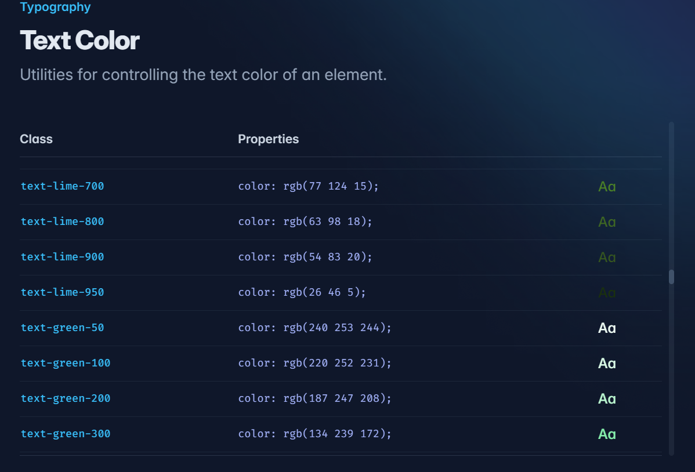
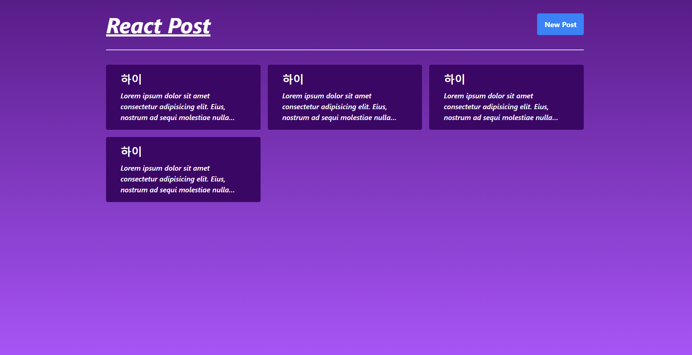

# 게시판 리스트 만들기

---

최근 `Udemy` 에서 `NextJS` 강의를 할인 하길래 12000원 주고 호다닥 구매했습니다.

그런데 강의 초반의 대부분 내용이 `React , NodeJS` 를 이용한 `Recap` 느낌이길래 한 번 해봤습니다.

구현할 컴포넌트는 `Form` 을 이용한 모달창으로 게시글을 추가하고 , 추가된 게시글을 렌더링 하는 컴포넌트들입니다.

이번 목표는 `tailwind` 와 `styled-component` 를 야무지게 써보려고 합니다.

테일윈드는 처음 써보지만 한 번 렛츠고

# `tailwind` 환경 설정

```
npm install -D tailwindcss
npx tailwindcss init
```

다음과 같이 필요한 라이브러리들을 서렁해줒고 `tailwind.config.js` 에서 다음과 같이 추가해줍니다.

```dotnetcli
/** @type {import('tailwindcss').Config} */
module.exports = {
  content: ["./src/**/*.{html,js}"],
  theme: {
    extend: {},
  },
  plugins: [],
}
```

이후 사용할 `main css` 파일인 `index.css` 에 다음과 같이 추가해줍니다.

```css
@tailwind base;
@tailwind components;
@tailwind utilities;
```

`tailwind` 를 사용하기 위한 설정은 끝났습니다.

_🪢 <a href = 'https://velog.io/@mjieun/React-React%EC%97%90%EC%84%9C-Tailwind-CSS-%EC%82%AC%EC%9A%A9%ED%95%98%EA%B8%B0'>[React] React에서 Tailwind CSS 사용하기</a>_

이제 `tailwind` 에서 제공하는 클래스명을 찾아 적용해주면 `tailwind` 에서 지정된 스타일을 사용 할 수 있습니다.

매우 친절하게도 `tailwind` 공식 홈페이지에서 필요한 스타일 별 클래스 명을 매~우 이쁘게 보여줍니다.



하나하나 참고하면서 만들어봅시다 :)

---

# `UI` 생성하기

---

```tsx
import Background from './Components/Background';
import Header from './Components/Header';
import HorizontalLine from './Components/HorizontalLine';
import Board from './Components/Board';
function App() {
  return (
    <Background>
      <Header />
      <HorizontalLine />
      <Board />
    </Background>
  );
}

export default App;
```



튜토리얼에서 사용하는 디자인을 참고하여 만들었습니다.

`tailwind` 처음 써보는데 통일된 스타일을 클래스 명 양식을 이용해 쓰면 되니 전체적인 디자인이 통일되어 좋은 것 같습니다.

그런데 스타일 별로 클래스명을 구구 절절 써야하는데 다른 사람들은 어떻게 쓰는지 나중에 레퍼런스를 찾아봐야겠습니다.

> 하다보니 `      <button className='px-4 py-2 bg-blue-500 hover:bg-blue-700 font-bold text-white rounded transition-colors border-none'>`이런식에 매우 긴 ~ 엘리먼트를 생성하게 됩니다. :(

이제 기능을 하나씩 추가해봅시다.

# `Modal` 창 구현하기

---

이제 `Header` 부분에 존재하는 `new Post` 버튼을 누르면 모달창이 생성되고 , 모달창에 적힌 포스트에 추가해주기로 합시다.

그럼 모달을 여닫기 위한 상태인 `isModalOpen` 상태를 정의해봅시다.

그럼 우리는 두 가지를 생각해봐야 합니다.

**`isModalOpen` 은 어디서 정의할까 ?**

**`Modal` 은 어디에 정의해둘까 ?**

```tsx
function App() {
  return (
    <Background>
      <Header /> {/* new Post 버튼이 있는 영역 */}
      <HorizontalLine />
      <Board /> {/* Post 들이 렌더링 되는 영역 */}
    </Background>
  );
}
```

#### `Header` 컴포넌트의 모습

```tsx
const Header = () => {
  return (
    <section className='flex justify-between'>
      <h1 className='text-5xl font-bold text-white italic underline'>
        React Post
      </h1>
      <button className='px-4 py-2 bg-blue-500 hover:bg-blue-700 font-bold text-white rounded transition-colors border-none'>
        New Post
      </button>
    </section>
  );
};

export default Header;
```

#### `Board` 컴포넌트의 모습

```tsx
import { useState } from 'react';
import PostBox, { Post } from './PostBox';

const Board = () => {
  const [posts, setPosts] = useState<Post[]>([
    /* 예시 데이터들 존재 */
  ]);

  return (
    <section className='grid grid-cols-3 gap-4'>
      {posts.map((post) => (
        <PostBox key={post.id} post={post} />
      ))}
    </section>
  );
};

export default Board;
```

1. `isModalOpen` 상태는 `Header` 부분에 담긴 이벤트 핸들러에 의해 상태가 변경됩니다.
2. `Modal` 내부에서 적힌 글 내용은 `Board` 에 존재하는 `posts` 배열에 추가되어야 합니다.
3. `Modal` 은 전역적으로 렌더링 되어야 합니다.
