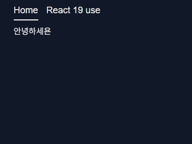

# use 를 사용하지 않고 서버 컴포넌트에서 클라이언트 컴포넌트로 데이터를 내려주는 경우

```tsx
import { getTodos } from "../api"; // delay가 1500ms 존재하는 서버 액션
import { WithoutUsePageFlipper } from "./item";

export const React19UsePage: React.FC = async () => {
  const todos = await getTodos();
  return (
    <div>
      <h1>React 19 Use</h1>
      <WithoutUsePageFlipper todos={todos} /> // client component
    </div>
  );
};
```

```tsx
"use client";

export const WithoutUsePageFlipper: React.FC<PageFlipperProps> = ({
  todos,
}) => {
  const [currentPage, setCurrentPage] = useState(0);
  const totalPage = todos.length - 1;
  const todo = todos[currentPage];

  const handleNext = () => {
    setCurrentPage((prev) => (prev + 1 > totalPage ? 0 : prev + 1));
  };
  const handlePrev = () => {
    setCurrentPage((prev) => (prev - 1 < 0 ? totalPage : prev - 1));
  };

  return (
    <section>
      <CurrentTodo
        totalPage={totalPage}
        currentPage={currentPage}
        todo={todo}
      />
      <div className="flex gap-2 mt-2">
        <PageFlipperButton onClick={handlePrev}>Prev</PageFlipperButton>
        <PageFlipperButton onClick={handleNext}>Next</PageFlipperButton>
      </div>
    </section>
  );
};

//이하 기타 컴포넌트 생략
```

다음과 같이 `getTodos` 서버 액션을 통해 데이터를 가져와 클라이언트 컴포넌트에게 전달해주는 경우를 생각해보자

현재는 서버 컴포넌트에서 `getTodos` 의 데이터를 페칭해오기 전 까지 `return` 문이 지연됨으로서 다음과 같은 현상이 발생 한다.



이는 분명하게 올바르지 않은 모습이다.

이를 해결하기 위한 다양한 방법의 예시를 살펴보자

- 서버 액션을 시행하는 랩퍼 컴포넌트 생성 하기

```tsx
export const React19UsePage: React.FC = async () => {
  return (
    <div>
      <h1>With out use Hooks</h1>
      <Suspense fallback={<div>Loading...</div>}>
        <TodoWrapper />
      </Suspense>
    </div>
  );
};

const TodoWrapper = async () => {
  const todos = await getTodos();
  return <WithoutUsePageFlipper todos={todos} />;
};
```

가장 사용하기 쉬운 방법은 이 처럼 서버 액션을 시행할 서버 컴포넌트를 따로 만든 후

해당 랩퍼 컴포넌트를 `Suspense` 블록으로 감싸는 것이다.

- 기타 다른 방법들

혹은 클라이언트 컴포넌트에서 직접 데이터를 `fetching` 해오고 로딩 하는 동안 `isLoading` 과 같은 `boolean` 값으로 조건부 로딩 하는 방법이 존재 할 것이다.

혹은 `react-query , SWR` 과 같은 라이브러리를 이용해서 `Suspense` 블록을 이용 하는 방법이 존재 할 수도 있다.

## 기존의 방법들이 비효율적이라 느껴진 점

```tsx
export const React19UsePage: React.FC = async () => {
  return (
    <div>
      <h1>With out use Hooks</h1>
      <Suspense fallback={<div>Loading...</div>}>
        <TodoWrapper />
      </Suspense>
    </div>
  );
};

const TodoWrapper = async () => {
  const todos = await getTodos();
  return <WithoutUsePageFlipper todos={todos} />;
};
```

우선 이 처럼 서버 액션을 시행 할 일명 랩퍼 컴포넌트를 생성하는 패턴에 대해 생각해보자

나는 이 패턴이 비효율적이라 느껴졌던 이유는 로딩 처리를 위해 불필요한 컴포넌트를 하나 더 만들었기 때문일 것이다.

그럼 클라이언트 단에서 데이터를 가져오는 패턴을 생각 해보자

직접 `useEffect` 를 통해 가져오거나 다른 라이브러리등을 사용해서 말이다.

해당 방법을 사용하게 되면 `NextJS` 의 `SSR` 을 이용함으로서 얻게 되는 이점인 서버 액션의 캡슐화가 이뤄지지 않게 된다.

또한 api 처리를 용이하게 하기 위한 라이브러리들을 설치함으로서 종속성이 더 늘어나게 된다.

# use 훅 등장

이번 `React-19` 업데이트 문서들을 읽으며 가장 느껴진 것은 리액트의 방향성이 최대한 라이브러리 없이도 개발이 가능하도록 지원 하고 있는 듯 느껴졌다.

특히 `use , Form Action , useFormState , useActionState` 등과 같이 api 요청과 관련된 상태 로직등을 내부적으로 다루도록 한 것을 보고 느껴졌다.

> 아직은 `use` 밖에 유심히 보지 못햇다.

[use](https://ko.react.dev/reference/react/use)의 주 사용 법은 다음과 같다.

- 기존 훅과 달리 조건부적으로 특정 `Context` 를 조회하기
- **Promise 데이터를 스트리밍 하기**

이론들을 보기 전 사용 예시를 먼저 보자

## use 훅 사용법

```tsx
"use client";

interface PageFlipperProps {
  todoPromise: Promise<Todo[]>;
}

export const WithUsePageFlipper: React.FC<PageFlipperProps> = ({
  todoPromise,
}) => {
  const todos = use(todoPromise);
  // 이하 이전과 동일함
```

우선 클라이언트 컴포넌트에선 `Promise` 형태로 된 props 를 받도록 수정하고

컴포넌트 내부에선 `use` 훅을 통해 해당 `Promise` 를 `fulfilled` 시킨다.

```tsx
// 더 이상 promise 를 awaited 하지 않는다.
export const React19UsePage: React.FC = () => {
  return (
    <div>
      <h1>With use Hooks</h1>
      <Suspense fallback={<div>Loading...</div>}>
        <WithUsePageFlipper todoPromise={getTodos()} />
      </Suspense>
    </div>
  );
};
```

그리고 서버 컴포넌트 단에선 단순히 Promise 형태를 클라이언트 컴포넌트에게 전달해주면 된다.

세상에나 이렇게 간편 할 수가

# 해당 이용 방법이 가능한 이유

## Concurrent Mode

이 부분에 대해서는 훨씬 잘 설명한 블로그들의 링크를 첨부하도록 한다.

1. [Concurrent React](https://velog.io/@jay/Concurrent-React)
2. [React 18의 새로운 기능: 동시성 모드(Concurrent Mode)](https://w55ng.com/entry/React-18%EC%9D%98-%EC%83%88%EB%A1%9C%EC%9A%B4-%EA%B8%B0%EB%8A%A5-%EB%8F%99%EC%8B%9C%EC%84%B1-%EB%AA%A8%EB%93%9CConcurrent-Mode)

요약하자면 리액트에서 렌더링 과정에서 모든 컴포넌트를 동기적으로 렌더링 하는 것이 아닌

필요에 따라 특정 컴포넌트의 렌더링을 지연 시키고 다른 컴포넌트를 우선적으로 렌더 하는 것이다.

`use` 의 경우엔 `use` 를 호출한 컴포넌트가 `Suspense block` 으로 감싸져있는 경우에는 `fallback UI` 를 보이도록 지연 시킨다.

> Suspense 와 관련된 내부 로직은 해당 영상을 레퍼런스로 남기도록 한다.
>
> [[10분 테코톡] 클린의 서스펜스와 에러바운더리 - YouTube](https://www.youtube.com/watch?v=yQDsd1OVR08)

호호 그냥 정리하자면 `use`훅 자체는 컴포넌트의 렌더링을 손쉽게 지연 시켜주는 훅으로 생각 할 수 있을 거 같다.
