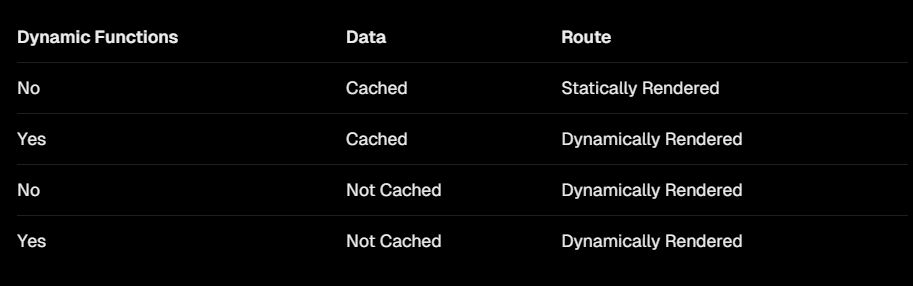
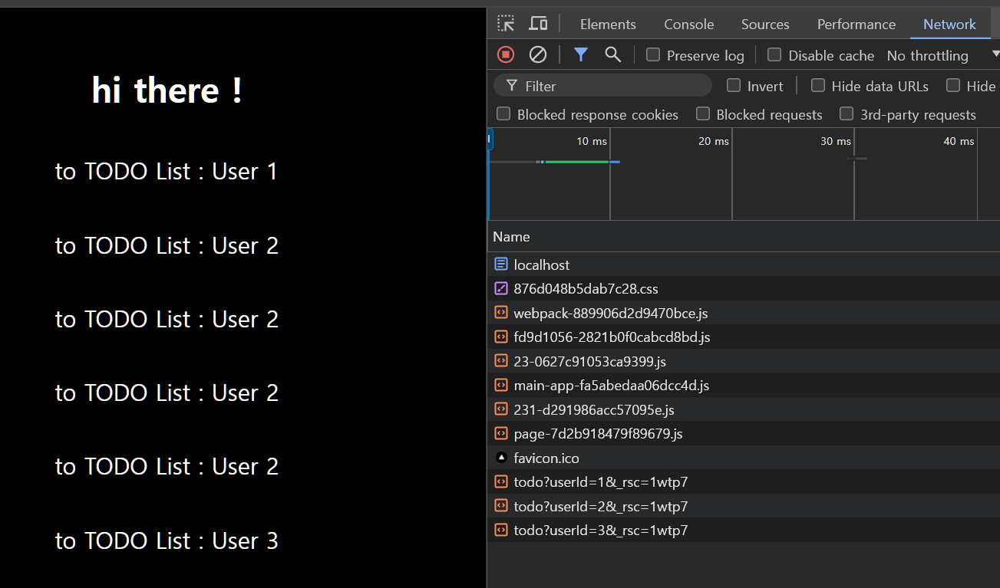

# `SSG , SSR .. ? ` vs `Server , Client Component`

---

이전 `docs` 에서 `NextJS` 의 렌더링 전략에 대해 이야기 했습니다.

`SSG ,SSR` 로 가능한 컴포넌트들은 서버 컴포넌트로 작성하고 `CSR` 을 해야 하는 컴포넌트는 클라이언트 컴포넌트로 정의한다고 했습니다.

`SSG , SSR , CSR , ISR` 등과 같은 개념으로 `NextJS` 를 이해하는 것은 `Page Routinng` 기법을 이용 할 때 도움이 됩니다.

서버 컴포넌트와 클라이언트 컴포넌트로 `NextJS` 를 이해하는 것은 `App Routing` 기법을 이용할 때 도움이 됩니다.

애초에 `NextJS` 공식문서에 `App Routng , Page Routing` 일 때의 문서가 다르며 어떤 라우팅 기법을 사용하냐에 따라 사용하는 방식이 다릅니다.

저는 `NextJS` 를 사용 할 떄 `App Routing` 기법을 이용 할 것이기 때문에 `App Routing` 관점인 서버 컴포넌트와 클라이언트 컴포넌트들을 공부하려 합니다.

우선 이번 `docs` 에선 서버 컴포넌트만 먼저 공부토록 하겠습니다.

# `Server Component`

---

`NextJS` 에서 `use client` 와 같이 선언해주지 않으면 기본적으로 모든 컴포넌트는 서버 컴포넌트입니다.

서버 컴포넌트는 서버에서 먼저 렌더링 되어 문서를 생성하고 생성된 문서를 클라이언트에게 보내줍니다.

서버 컴포넌트가 서버에서 렌더링 되어 문서로 생성되는 과정은 다음과 같습니다.

1. `React` 가 서버 컴포넌트를 호출하여 `NextJS` 가 이해 할 수 있는 `React Server Componet Payload (RSCP)` 로 변경합니다.
2. 클라이언트 컴포넌트를 호출하고 `RSCP` 에 근거하여 `index.html` 문서를 생성합니다.
3. 이 때 생성된 `index.html` 은 클라이언트 컴포넌트가 클라이언트 단에서 `hydrate` 되지 않는 한 인터렉티브한 기능을 사용 할 수 없습니다.

### `Server Component without data`

---

```tsx
export default function Home() {
  return (
    <section style={style}>
      <h1>hi there !</h1>
      <Link href='/todo'>to TODO List</Link>
    </section>
  );
}
```

서버 컴포넌트는 다음과 같이 사용 될 수 있습니다.

이는 어떤 `state` 나 인터렉티브한 기능이 존재하지 않기 때문에 서버에서 렌더링 되어 `html` 문서 형태로 생성됩니다.

이렇게 **어떤 외부데이터에도 의존하지 않는 서버 컴포넌트는 `build` 할 때 한 번만 호출되어 생성됩니다.**

### `Server Component with data`

위에서 `/todo` 라우트 경로에 이동하면 외부 데이터인 투 두 리스트를 페칭 받아 렌더링 하는 페이지가 존재한다고 가정해봅시다.

`NextJS` 의 서버 컴포넌트는 데이터를 호출하는 과정을 컴포넌트 외부에서 작성해줄 수 있습니다.

```tsx
/* app/todo/page.tsx*/
import { fetchData } from '@/lib/fetchData';

type Todo = {
  userid: number;
  id: number;
  title: string;
  completed: boolean;
};

export default async function TodoList() {
  /* 외부에서 정의된 데이터를 페칭해오는 함수*/
  const todos = await fetchData<Todo[]>();
  return (
    <ul>
      {todos.map(({ id, title }) => (
        <li key={id}>{title}</li>
      ))}
    </ul>
  );
}
```

```tsx
/* lib/fectaData.tsx */
export async function fetchData<T>(): Promise<T> {
  const EndPoint = 'https://jsonplaceholder.typicode.com/todos';
  const response = await fetch(EndPoint);
  const data = await response.json();

  return data.slice(0, 5) as T;
}
```

서버 컴포넌트의 가장 큰 특징은 외부로부터 데이터를 패칭해오는 로직을 서버 단에서 처리하고 데이터만을 컴포넌트에 주입 해줄 수 있다는 점입니다.

이를 통해 민감한 정보가 담긴 로직을 클라이언트 단에 공개하지 않을 수 있습니다.

민감한 `API KEY` 가 존재하거나 외부에 공유하고 싶지 않은 코드 등을 감추는 것이 가능합니다.

이 뿐 아니라 , 컴포넌트들이 단순히 **정보를 렌더링 한다** 라는 로직 하나만을 갖게 하는 것이 가능합니다.

# `Server Component` 의 렌더링 시점

---

그렇다면 이런 의문이 듭니다.

이전 `Route` 를 설명 할 때 `NextJS` 는 필요한 데이터들을 `pre-fetch` 해둬 필요한 데이터들을 이용해 필요한 데이터들을 생성해둔다고 했습니다.

그럼 `pre-fetch` 를 하는 시점이 언제일까요 ?

`build` 하는 시점 딱 한 번만 `pre-fetch` 를 할까요 ? 아니면 클라이언트의 뷰포트에 보이는 시점에 `pre-fetch` 할까요 ?

`Page Routing` 을 사용한 `NextJS` 에선 `build` 시점의 `pre-fetch` 하는 함수와 런타임 시 `pre-fetch` 하는 함수를 다르게 정의하여 사용해야 했습니다.

하지만 `App Routing` 을 사용하는 `NextJS` 에선 `build` 시점의 `pre-fetch` , 런타임 시점의 `pre-fetch` 를 **`NextJS` 가 알아서 판단합니다.**

`NextJS` 가 판단하기에 `build` 시점에만 패칭해두면 되는 서버 컴포넌트는 `build` 시점에 패칭해둔 데이터를 이용하고

런타임 시점에 `pre-fetch` 해야 하는 서버 컴포넌트는 런타임 시 `pre-fetch` 합니다.

이렇게 `build` 시점에 렌더링 되는 경우를 `Statically Renderinng` , 런타임 시점에 렌더링 되는 경우를 `Dynamic Rendering` 이라고 합니다.

> - 모든 서버 컴포넌트는 클라이언트 측으로 넘어가기 전 서버 단에서 렌더링 된 후 완성된 페이지를 생성합니다.
> - 여기서 `pre-fetch` 란 컴포넌트가 렌더링 되기 전 데이터를 패칭해오는 행위를 의미합니다.

## `Dynamic Renderinng vs  Statically Renderinng`

---



`NextJS` 는 서버 컴포넌트의 두 가지 유무를 보고 `Dynamic Rendering , Statically Rendering` 을 결정합니다.

### `Dynamic Function`

---

`Dynamic Function` 이란 **런타임 시 결정되는 인수들을 반환하는 함수들을 의미**합니다.

예를 들어 런타임 시 알 수 있는 `serachParams` 라든지, 사용자의 `request` 에 담긴 정보를 이용하는 경우와 같은 클라이언트 측의 정보를 포함합니다.

클라이언트 측의 정보를 알 수 있는 `Dynamic Function` 들은 `NextJS` 에서 제공합니다.
`[cookies() ,  searchParams() , headers()]`

클라이언트 정보 뿐이 아니라 다른 런타임 데이터 (외부, 내부 상관 없이) 를 이용하는 경우도 `Dynamic Function` 에 해당합니다.

### `Cached`

---


_🪢 <a href = 'https://nextjs.org/docs/app/building-your-application/caching'>NextJS Cache</a>_

캐시에 관련된 내용을 해당 `docs` 에서 적기엔 내용이 중요하고 깊어서 추후 다루려 합니다.

다만 중요한 부분은 `NextJS` 에선 동일한 요청들은 메모리나 `CDN` 에 캐싱해두고

동일한 요청들이 2번 이상 반복되고 캐싱 되어 있다면 캐싱된 데이터를 사용한다는 점입니다.

만약 페이지를 만드는 과정 (이를 `Rendnering pass` 라고 합니다.)에서 상단 컴포넌트에서 `A` 라는 요청에 대해 `GET` 을 보냈다면 해당 요청에 대한 응답값이 캐싱됩니다.

이후 하단에서 `A` 라는 요청을 다른 컴포넌트에서 호출한다면 요청을 보내지 않고 캐싱된 값을 이용하게 됩니다.

> 경우에 따라 다릅니다. 캐싱 된 데이터를 이용 할 때 `revalidate` 옵션 값을 넣어 캐싱된 데이터의 신선도를 검사할 수도 있습니다.

> ### 정리
>
> 서버 컴포넌트들은 `Dynamic Rendering , Statically Rendering` 중 적절한 기법에 따라 서버 측에서 렌더링 되고 클라이언트 측으로 전송됩니다.

# `Server Component` 의 `Streaming`

---

```tsx
export default async function TodoList() {
  const todos = await fetchData<Todo[]>();
  return (
    <ul>
      {todos.map(({ id, title }) => (
        <li key={id}>{title}</li>
      ))}
    </ul>
  );
}
```

해당 서버 컴포넌트는 `async / await` 를 통해 `fetchData` 함수가 완료 될 때 까지 컴포넌트가 반환되지 않습니다.

그렇다면 만약 외부 데이터를 사용하는 서버 컴포넌트가 `N` 개 이상일 때 `NextJS` 는 `N` 개의 요청을 어떻게 처리할까요 ?


`NextJS` 에선 서버 컴포넌트들의 요청을 병렬적으로 처리합니다.

그렇기에 클라이언트에게 보내는 데이터를 완성하는 `Rendering pass` 기간동안 요청들은 모두 병렬적으로 처리되기 때문에 요청 개수가 늘어나는 것은 문제가 되지 않습니다.

> 물론 요청이 너무 많아 브라우저에서 사용 가능한 네트워크의 개수보다 높다면 문제가 될 수 있습니다.

```tsx
export async function fetchData<T>(): Promise<T> {
  const EndPoint = 'https://jsonplaceholder.typicode.com/todos';
  /* 지연을 주기위해 해보자 */
  await new Promise((res) => setTimeout(() => res(true), 3000));
  const response = await fetch(EndPoint);
  const data = await response.json();

  return data.slice(0, 5) as T;
}
```

하지만 각 요청이 지연된다면 문제는 여전히 발생합니다.

다음과 같이 `fetchData` 가 실행되는 동안 `delay` 가 일어난다면 렌더링 되는 기간 동안 해당 페이지로 라우팅 되지 못하는 경우가 발생합니다.

`Rendering pass` 가 완료되지 않았기 때문입니다.

이 경우를 효과적으로 해결하기 위해 `NextJS` 에선 `Streaming` 이란 기법을 사용하기를 추천합니다.


`Streaming` 이란 `React.Suspense` 컴포넌트를 이용하여 요청이 완료되기 전 `Rendering pass` 가 완료되지 않았더라도

`Suspense` 의 `fallback` 이 렌더링 되도록 하는 방법입니다.

```tsx
import { Suspense } from 'react';

...

async function TodoList() {
  const todos = await fetchData<Todo[]>();
  return (
    <ul>
      {todos.map(({ id, title }) => (
        <li key={id}>{title}</li>
      ))}
    </ul>
  );
}

function Loading() {
  return <div> data is Loading ...</div>;
}

export default function Page() {
  return (
    /* Streaming 할 컴포넌트를 children 으로 받음 */
    <Suspense fallback={<Loading />}>
      <TodoList />
    </Suspense>
  );
}
```

다음과 같이 `Suspense` 를 이용하면 서버 컴포넌트들을 `Streaming` 기법을 이용해줄 수 있습니다.

# 서버 컴포넌트를 이용했을 때 네트워크 창의 모습

---

위에서 서버 컴포넌트를 이용하여 외부 데이터를 가져올 때의 네트워크 요청이 서버단에서 일어나기 때문에 네트워크 요청을 추상화 할 수 있다고 하였습니다.

실제 요청 사항을 보면 다음과 같습니다.


```js
/* Response 예시 */
3:I["(app-pages-browser)/./node_modules/next/dist/client/components/layout-router.js",["app-pages-internals","static/chunks/app-pages-internals.js"],""]
4:I["(app-pages-browser)/./node_modules/next/dist/client/components/render-from-template-context.js",["app-pages-internals","static/chunks/app-pages-internals.js"],""]
1:D{"name":"","env":"Server"}
2:D{"name":"Page","env":"Server"}
2:D{"name":"TodoList","env":"Server"}
5:D{"name":"","env":"Server"}
0:["development",[["children","todo",["todo",{"children":["__PAGE__",{}]}],["todo",{"children":["__PAGE__",{},[["$L1","$L2"],null],null]},["$","$L3",null,{"parallelRouterKey":"children","segmentPath":["children","todo","children"],"error":"$undefined","errorStyles":"$undefined","errorScripts":"$undefined","template":["$","$L4",null,{}],"templateStyles":"$undefined","templateScripts":"$undefined","notFound":"$undefined","notFoundStyles":"$undefined","styles":null}],null],[null,"$L5"]]]]
5:[["$","meta","0",{"name":"viewport","content":"width=device-width, initial-scale=1"}],["$","meta","1",{"charSet":"utf-8"}],["$","title","2",{"children":"Create Next App"}],["$","meta","3",{"name":"description","content":"Generated by create next app"}],["$","link","4",{"rel":"icon","href":"/favicon.ico","type":"image/x-icon","sizes":"16x16"}]]
1:null
```

> `RSCP` 를 정확히 보기 위해 `Suspense` 컴포넌트는 주석처리 하였습니다.

`Todo[]` 데이터를 패칭해오는 네트워크 요청은 서버단에서 일어나기 떄문에 `Todo[]` 데이터를 패칭해오는 네트워크 결과는 클라이언트 단에서 볼 수 없고

오로지 `/todo` 라우트에서 렌더링 되기 위해 필요한 문서 정보 (`RSCP`) 네트워크 요청만 일어나는 모습을 볼 수 있습니다.

이를 통해 민감한 정보가 담긴 네트워크 요청을 감추는 것이 가능하다는 의미입니다.

# `Dynamic Function` 을 이용한 `Dynamic Rendering`

---

위의 내용들은 서버 컴포넌트의 전반적인 내용과 `cache` 에 대한 이야기를 나눴습니다.

그럼 이번엔 `Dynamic Function` 에 따른 `Dynamic Rendering` 을 공부해보겠습니다.

> ### 시나리오
>
> 사용자가 라우팅 되는 경로에 따라 페칭해오는 값이 다르게 오는 경우

## 동적 라우팅

---

```tsx
import Link from 'next/link';

const style: React.CSSProperties = {
  display: 'flex',
  flexDirection: 'column',
  alignItems: 'center',
  padding: '40px',
  gap: '30px',
};

export default function Home() {
  return (
    <section style={style}>
      <h1>hi there !</h1>
      <Link href={{ pathname: '/todo', query: { userId: 1 } }}>
        to TODO List : User 1
      </Link>
      <Link href='/todo?userId=2'>to TODO List : User 2</Link>
      <Link href={{ pathname: '/todo', query: { userId: 3 } }}>
        to TODO List : User 3
      </Link>
    </section>
  );
}
```

다음과 같이 `Link` 컴포넌트에서 쿼리 파라미터문을 이용해 동적 라우팅을 한다고 해봅시다.

> 동적 라우팅은 위처럼 `href` 에 `pathname ,query` 를 이용해주저도 되고 문자열로 작성해도 됩니다.

만약 `User 2` 를 누르면 `/todo?userId=2` 경로로 라우팅 됩니다.

```tsx
import { fetchData } from '@/lib/fetchData';
import { Suspense } from 'react';

type Todo = {
  userid: number;
  id: number;
  title: string;
  completed: boolean;
};

type TodoSearchParam = {
  userId: string;
};

async function TodoList({ searchParams }: { searchParams: TodoSearchParam }) {
  const { userId } = searchParams;
  const todos = await fetchData<Todo[]>(userId);
  return (
    <ul>
      {todos.map(({ id, title }) => (
        <li key={id}>{title}</li>
      ))}
    </ul>
  );
}

function Loading() {
  return <div> data is Loading ...</div>;
}

export default function Page({
  searchParams,
}: {
  searchParams: TodoSearchParam;
}) {
  return (
    <Suspense fallback={<Loading />}>
      <TodoList searchParams={searchParams} />
    </Suspense>
  );
}
```

이후 `/todo` 경로에서 렌더링될 `Page` 컴포넌트에서 `SearchParams` 를 받아 `fetchData` 함수에 인수로 넘겨줍니다.

```tsx
export async function fetchData<T>(userId: string): Promise<T> {
  const EndPoint = `https://jsonplaceholder.typicode.com/todos?userId=${userId}`;
  const response = await fetch(EndPoint);
  const data = await response.json();

  return data.slice(0, 5) as T;
}
```

각 라우트에서 렌더링 되는 유니크한 페이지 컴포넌트는 `params , searchParams` 를 인수로 받습니다.

`params` 는 `/ (segment)` 기준으로 존재하는 경로들을 의미합니다. 저는 쿼리문을 이용햇으니 `searchParams` 를 가져와 사용해줍니다.

이제 `/todo?userId = ***` 에 대한 경로들은 모두 `Dynamic Rendering` 을 하게 됩니다.

# 마지막으로 `Dynamic Rendering => Statically Rendering` 확인해보기

---

그렇다면 데이터가 캐싱되는 경우 `Statically Rendering` 을 사용한다 했으니 실제로 그런지 예시를 살펴봅시다.

```tsx
import Link from 'next/link';

const style: React.CSSProperties = {
  display: 'flex',
  flexDirection: 'column',
  alignItems: 'center',
  padding: '40px',
  gap: '30px',
};

export default function Home() {
  return (
    <section style={style}>
      <h1>hi there !</h1>
      <Link href={{ pathname: '/todo', query: { userId: 1 } }}>
        to TODO List : User 1
      </Link>
      <Link href='/todo?userId=2'>to TODO List : User 2</Link>
      {/* userId=2 에 대한 Statically Renderng 실험 */}
      <Link href='/todo?userId=2'>to TODO List : User 2</Link>
      <Link href='/todo?userId=2'>to TODO List : User 2</Link>
      <Link href='/todo?userId=2'>to TODO List : User 2</Link>
      {/* userId=2 에 대한 Statically Renderng 실험 */}
      <Link href={{ pathname: '/todo', query: { userId: 3 } }}>
        to TODO List : User 3
      </Link>
    </section>
  );
}
```



`User2` 에 대한 `fetching` 값들이 캐싱되어 `user=2` 에 대한 요청이 한번만 간 모습을 볼 수 있습니다. :)
