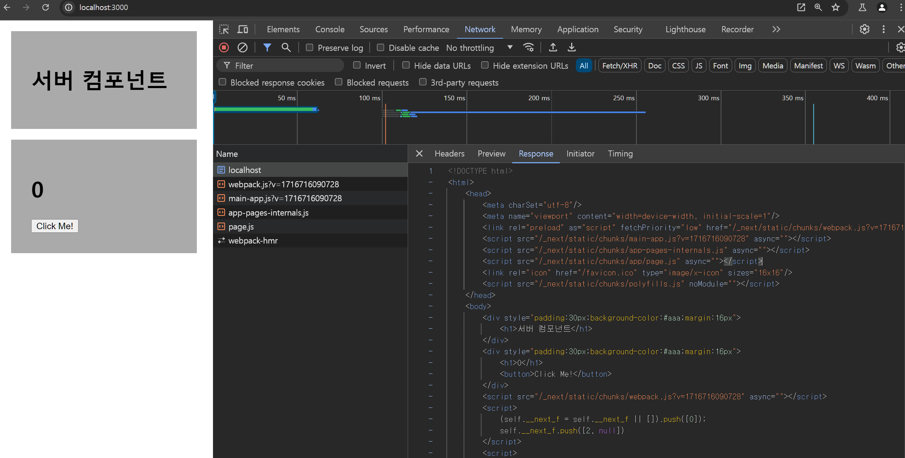
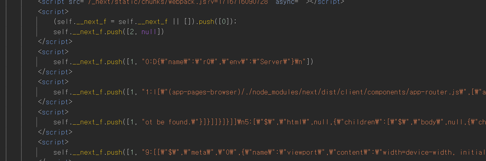
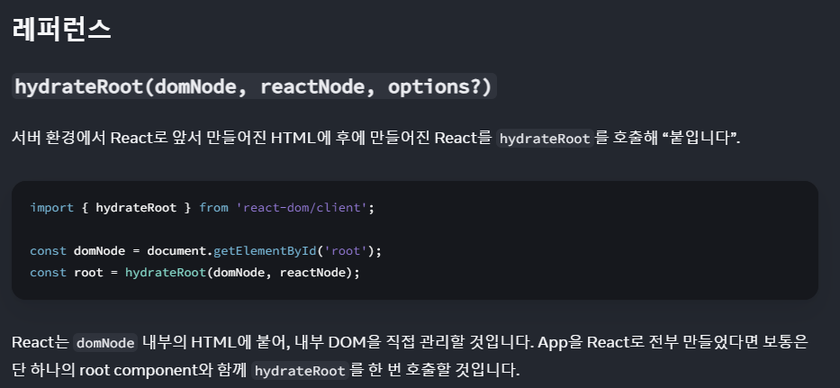

# `Client Component`

---

클라이언트 컴포넌트란 , 인터렉티브한 `UI` 를 위해 서버 단에서 `prerender` 된 후 클라이언트 단에서 `hydrate` 되는 컴포넌트를 칭한다.

### `hydrate` ?

> Hydration is like watering the “dry” HTML with the “water” of interactivity and event handlers.

리액트의 코어 멤버인 `Dan Abramov` 가 설명한 `hydrate` 는 위 설명처럼 인터렉티브하지 않은 건조한 `UI` 를 인터렉티브한 촉촉한 `UI` 로 만드는 과정을 의미한다.

---

# `Client Compoent` 의 이점

`Client Component` 는 클라이언트 단에서 재실행 된다는 점에서 다음과 같은 이점들을 같는다.

1. `state` 와 같은 상태에 따라 값이 유동적으로 변하는 컴포넌트를 생성 할 수 있다.

`Server Component` 는 정적인 컴포넌트로, 인터렉션에 따라 실행되는 것이 아닌 서버에서 렌더링 된 결과를 보여주는 것에 집중한다.

하지만 `Client Component` 는 클라이언트 단에서 관리되고 변경되는 다양한 `state` 에 따라 인터렉티브한 `UI` 를 보여주기 위해 설계되었다.

이에 클라이언트 단에서 구동되는 자바스크립트 코드에 영향을 받는 `Client Component` 를 이용해 인터렉티브한 `UI` 를 생성 할 수 있다.

2. 브라우저의 `API` 를 이용 할 수 있다.

클라이언트 단에서 실행되는 자바스크립트 코드로 구성되어 있기 때문에 브라우저의 `API` 등을 이용 할 수 있다.

3. `Pre-Render` 되기 때문에 `FCP` 까지의 시간이 짧다.

`Client Component` 라고 해서 클라이언트 단에서만 실행되는 것이 아니라, 서버 단에서 미리 `Pre-Render` 된다.

> 물론 `Client` 단에서 실행되기 전까진 인터렉티브한 `UI` 를 만드는 것은 불가능하다.

이러한 `Pre-Rendner` 를 통해 `FCP` 까지의 시간이 짧아 `UX` 를 늘릴 수 있다.

# `Client Component` 사용법

---

`Client Component` 는 `'use client'` 를 상단에 정의해줌으로서 사용 할 수 있다.

`NextJS` 는 `'use client'` 로 선언된 문구를 통해 각 컴포넌트 모듈들의 `boundary` 를 정의한다.

### `boundary` 를 정의한다 ?

`NextJS` 에서의 컴포넌트들은 모두 `export , import` 로 불러오는 `module` 형태이다.

이 때 각 `module` 들의 `import` 를 통해 각 컴포넌트들의 의존성을 파악 할 수 있다.

`NextJS` 는 `'use client'` 로 정의된 컴포넌트에서 `import` 해오는 모듈들을 모두 `Client Component` 로 정의한다.

이렇게 의존성에 따라 `Client , Server Component` 를 구분하는 `boundary` 를 정하는 이유는 사실 매우 명확하다.

```tsx
'use client';

import { useState } from 'react';

import FancyButton from '@/src/components/FancyButton';
import FancyCount from '@/src/components/FancyCount';

const Home = () => {
  const [count, setCount] = useState<number>(0);
  const handleClick = () => setCount(count + 1);
  return (
    <>
      <FancyCount>{count}</FancyCount>
      <FancyButton handleClick={handleClick} />
    </>
  );
};

export default Home;
```

다음과 같이 `'use client'` 로 정의된 `Home` 컴포넌트는 `Client Component` 이다.

이 때 `Home` 컴포넌트에선 클라이언트 단에서 필요한 로직 (`state , eventHandler`) 들을 `import` 한 컴포넌트들에게 내려주고 컴포넌트를 구성한다.

이에 `NextJS` 는 암묵적으로 `Client Component` 와 의존성이 있는 모든 컴포넌트는 모두 `Client Component` 로 정의해버린다.

```tsx
/* FancyCount 는 암묵적으로 use client 로 선언된다. */
import styled from 'styled-components';

const FancyCountView = styled.h1`
  color: tomato;
`;

const FancyCount = ({ children }: { children: number }) => {
  return <FancyCountView>{children}</FancyCountView>;
};

export default FancyCount;
```

만약 암묵적으로 정의해버리지 않고 `FancyCount , FancyButton` 등을 기본값인 서버 컴포넌트로 정의해버린다면 상태 값에 따라 렌더링 되는 값이 변경되거나

`onClick` 이벤트를 부착하는 행위를 할 때 마다 컴파일 에러가 발생하게 될 것이다.

이렇게 `Client Component` 와 의존성이 존재하는 컴포넌트를 `Client Component` 로 암묵적으로 정의해주는 특성으로 인해 하위 컴포넌트들에서 불필요하게 `'use client'` 로 정의해주는 불필요한 반복을 하지 않아도 된다.

# `Client Component` 는 어떻게 렌더링 될까 ?

---

어떻게 서버 컴포넌트와 클라이언트 컴포넌트가 브라우저 단에서 렌더링 되는지를 비교하기 위해

서버 컴포넌트와 클라이언트 컴포넌트들을 이용한 페이지를 생성해보았다.

```tsx
'use client';

import ServerComponent from '@/src/components/ServerComponent';
import ClientComonent from '@/src/components/ClientComponent';

const Home = () => {
  return (
    <>
      <ServerComponent /> // 서버 컴포넌트
      <ClientComonent /> // 클라이언트 컴포넌트
    </>
  );
};

export default Home;
```

```tsx
const boxStyle = {
  padding: '30px',
  backgroundColor: '#aaa',
  margin: '16px',
};

const ServerComponent = () => {
  return (
    <div style={{ ...boxStyle }}>
      <h1>서버 컴포넌트</h1>
    </div>
  );
};

export default ServerComponent;
```

```tsx
'use client';

import { useState } from 'react';

const boxStyle = {
  padding: '30px',
  backgroundColor: '#aaa',
  margin: '16px',
};

const ClientComonent = () => {
  const [count, setCount] = useState<number>(0);
  return (
    <div style={{ ...boxStyle }}>
      <h1>{count}</h1>
      <button onClick={() => setCount(count + 1)}>Click Me!</button>
    </div>
  );
};

export default ClientComonent;
```

이후 서버에서 받은 `HTML` 파일의 생김새를 살펴보자



파일을 살펴보면 `html` 파일은 서버컴포넌트, 클라이언트 컴포넌트 모두 상관 없이 작성되어 있는 모습을 볼 수 있다.

이는 클라이언트 컴포넌트도 모두 서버 단에서 `Pre - Render` 된다는 것을 의미한다.

좀 더 스크롤을 내려 `script` 태그들을 살펴보자



`script` 태그들을 살펴보면 `self.__next_f.push` 와 함께 직렬화된 문자열을 볼 수 있다.

바로 이 문자열들이 `RSC Payload` 들로 `Client Component` 들이 `hydrate` 되기 위한 로직들을 의미한다.

처음 `html` 파일들이 `parsing` 되어 `hydrate` 되기 전의 파일들이 브라우저에서 렌더링 된 후

`script` 태그들이 실행되며 `Client Component` 들이 `hydrate` 되어 `interative UI` 를 구성한다.

# `RSC Payload` 에 담겨있는 로직들

---

결국 `Client Component` 는 `RSC Payload` 가 실행되면서 `Interactive UI` 로 `hydrate` 되는 것임을 알 수 있었다.

그럼 `RSC Payload` 엔 어떤 것들이 담겨있을까 ?

### 컴포넌트의 메타데이터 및 환경정보

---

```tsx
[
  {
    name: '',
    env: 'Server',
  },
  {
    name: 'RootLayer',
    env: 'Server',
  },
  {
    name: '',
    env: 'Server',
  },
];
```

직렬화된 `RSC Payload` 를 병렬화 하면 다음과 같이 컴포넌트들의 메타데이터와 `env` 를 통해 환경을 확인 할 수 있다.

### 컴포넌트의 상태와 `props`

---

```dotnetcli
[
  {
    "name": "NotFound",
    "env": "Server"
  },
  {
    "name": "NotFound",
    "env": "Server",
    "props": {
      "children": [
        {
          "tag": "title",
          "props": {
            "children": "404: This page could not be found."
          }
        },
        {
          "tag": "div",
          "props": {
            "style": {
              "fontFamily": "system-ui,Segoe UI,Roboto,Helvetica,Arial,sans-serif,Apple Color Emoji,Segoe UI Emoji",
              "height": "100vh",
              "textAlign": "center",
              "display": "flex",
              "flexDirection": "column",
              "alignItems": "center",
              "justifyContent": "center"
            },
            "children": [
              {
                "tag": "div",
                "props": {
                  "children": [
                    {
                      "tag": "style",
                      "props": {
                        "dangerouslySetInnerHTML": {
                          "__html": "body{color:#000;background:#fff;margin:0}.next-error-h1{border-right:1px solid rgba(0,0,0,.3)}@media (prefers-color-scheme:dark){body{color:#fff;background:#000}.next-error-h1{border-right:1px solid rgba(255,255,255,.3)}}"
                        }
                      }
                    },
                    {
                      "tag": "h1",
                      "props": {
                        "className": "next-error-h1",
                        "style": {
                          "display": "inline-block",
                          "margin": "0 20px 0 0",
                          "padding": "0 23px 0 0",
                          "fontSize": 24,
                          "fontWeight": 500,
                          "verticalAlign": "top",
                          "lineHeight": "49px"
                        },
                        "children": "404"
                      }
                    },
                    {
                      "tag": "div",
                      "props": {
                        "style": {
                          "display": "inline-block"
                        },
                        "children": [
                          {
                            "tag": "h2",
                            "props": {
                              "style": {
                                "fontSize": 14,
                                "fontWeight": 400,
                                "lineHeight": "49px",
                                "margin": 0
                              },
                              "children": "This page could not be found."
                            }
                          }
                        ]
                      }
                    }
                  ]
                }
              }
            ]
          }
        }
      ]
    }
  }
]
```

다음과 같은 계층 구조로 컴포넌트들이 가지는 정보들을 담은 문서이다.

### 컴포넌트의 계층 구조

---

```dotnetcli
[
  {
    "name": "App",
    "children": [
      {
        "name": "Header"
      },
      {
        "name": "Main",
        "children": [
          {
            "name": "Sidebar"
          },
          {
            "name": "Content"
          }
        ]
      }
    ]
  }
]

```

각 컴포넌트들의 이름과 `children` 을 통해 계층 구조를 표현한다.

### 클라이언트 사이드 이벤트 핸들러

---

```
[
  {
    name: 'ButtonComponent',
    env: 'Client',
    events: {
      onClick: 'handleClick',
    },
  },
];
```

다음과 같이 컴포넌트의 이름과 환경 , 장착할 이벤트 핸들러 정보를 담은 `payload` 도 존재한다.

### 스타일 및 스크립트 로딩 정보

---

```dotnetcli
[
  {
    "styles": [
      "/_next/static/css/main.css"
    ],
    "scripts": [
      "/_next/static/js/main.js"
    ]
  }
]
```

### 라우터 정보

---

```dotnetcli
[
  {
    "currentRoute": "/profile",
    "query": {
      "userId": "123"
    }
  }
]
```

컴포넌트에 대한 정보 뿐 아니라 라우팅 될 라우터의 정보도 `RSC Payload` 에 존재한다.

이러한 `RSC Payload` 를 통해 `hydrate` 가 진행되고 라우팅 기능이 존재하는 인터렉티브한 웹 앱을 생성 할 수 있다.

## `RSC Payload` 를 이용해 `hyrate` 되는 과정

---

`NextJS` 에서도 `React` 의 `hydrate` 를 이용한다고 이야기 한다.

`React` 의 `hydrate` 를 먼저 살펴보자


_🪢 <a href = 'https://ko.react.dev/reference/react-dom/client/hydrateRoot'>리액트의 hyrate 문서</a>_

`hyrateRoot` 는 `Actual DOM` 에 존재하는 `node` 를 `Virtual DOM` 의 `root Node` 로 선택한 후 `Virtual DOM` 들을 부착시키는 형태이다.

예시를 통해 살펴보자

```html
<!DOCTYPE html>
<html>
  <head>
    <title>My Next.js App</title>
  </head>
  <body>
    <div id="__next">
      <div>
        <h1>Welcome to My App</h1>
        <div id="content">
          <p>Loading...</p>
        </div>
      </div>
    </div>
    <script>
      window.__NEXT_DATA__ = {
        props: {
          pageProps: {
            initialData: 'Hello, world!',
            initialCount: 5,
          },
        },
        page: '/',
        query: {},
        buildId: 'development',
        assetPrefix: '',
        isFallback: false,
        gssp: true,
        appGip: false,
        scriptLoader: [],
      };
    </script>
    <script>
      self.__next_f.push([
        1,
        '0:D{"name":"WelcomeComponent","env":"Server"}\n1:D{"name":"CounterComponent","env":"Client","initialState":{"count":5}}\n2:D{"name":"FooterComponent","env":"Server"}\n',
      ]);
    </script>
  </body>
</html>
```

다음과 같은 `html` 파일과 `RSC Payload` 들이 담긴 `html` 파일을 받았다고 가정했을 때

우선적으로 `html` 의 문서를 토대로 `FCP` 가 일어나게 된다.

이후 `RSC Payload` 를 파싱하여 `Virtual DOM` 을 생성하게 된다.

```tsx
// 클라이언트 사이드 코드 (React 컴포넌트)
import React, { useState } from 'react';
import ReactDOM from 'react-dom';

const WelcomeComponent = ({ message }) => <h1>{message}</h1>; // 서버 컴포넌트

const CounterComponent = ({ initialCount }) => {
  // 클라이언트 컴포넌트
  const [count, setCount] = useState(initialCount);

  return (
    <div>
      <p>Count: {count}</p>
      <button onClick={() => setCount(count + 1)}>Increment</button>
    </div>
  );
};

const FooterComponent = () => <footer>Footer content here</footer>;
```

다음과 같이 서버 컴포넌트와 클라이언트 사이드 컴포넌트들이 혼재하여 존재한다고 했을 때

`RSC Payload` 를 파싱한 브라우저는 `RSC Payload` 에 존재하는 정보들을 전역 객체인 `window` 에 저장하게 된다.

```tsx
// 초기 데이터
const initialData = window.__NEXT_DATA__.props.pageProps.initialData;
const initialCount = window.__NEXT_DATA__.props.pageProps.initialCount;

hydrateRoot(
  document.getElementById('__next'),
  <div>
    <WelcomeComponent message='Welcome to My App' />
    <CounterComponent initialCount={initialCount} />
    <FooterComponent />
  </div>,
);
```

이후 저장되어 있는 데이터들을 가지고 와 `hydrateRoot` 를 이용해 `Virtual DOM` 을 생성한다.

> 이 때 `Virtual DOM` 을 생성하기 위해 `Server Component` 들도 초기에 한 번은 렌더링 된다. 하지만 이후엔 `stateless` 한 컴포넌트들이기 때문에 `re-rendering` 이 일어나지 않는다.
>
> `Client Component` 이하에 존재하는 모든 컴포넌트는 `Client Component` 가 되는 `boundary` 를 갖는다고 했던 것을 기억 할 수 있다.
> 이는 `Virtual DOM` 에서 `Client Component` 가 리렌더링 되면 하위에 존재하는 모든 컴포넌트가 리렌더링 되기 때문이다.

이런 `hyrate` 과정을 통해 `html` 태그에서 `Pre-render` 된 태그들은 `Virtual DOM` 에서 `hydrate` 된 컴포넌트와 1:1 매칭이 되기 때문에 인터렉티브한 컴포넌트가 될 수 있다.
