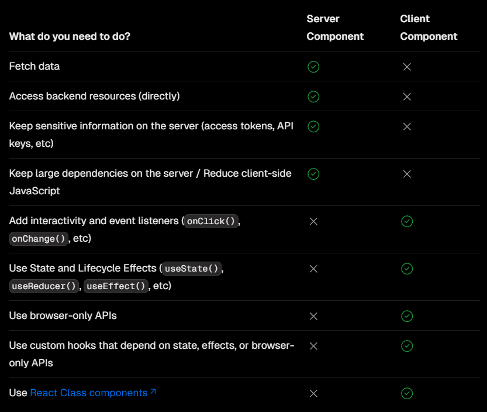

# `Server , Client Component` 합성 패턴

---

`NextJS` 에선 다양한 이유로 `Server ,Client Component` 를 구분해 둔다고 저번 `docs` 들에서 설명했다.

이후 이 두 패턴들을 함께 사용하기 위해 어떤 법칙들을 지켜야 하는지 알아보자

## `Server , Client Component` 이 사용되는 경우

---

우선 어떤 경우에 `Server , Client Component` 가 사용되는지 정리된 표를 살펴보자



### `Server Component`

---

주로 서버 컴포넌트는 서버에 저장된 데이터를 이용하여 렌더링 하는 경우 사용 할 것을 추천하고 있다.

서버와 인터렉션 하는 경우의 로직을 숨김으로서 민감한 정보를 숨길 수 있기 때문이다.

또한 굳이 클라이언트 단에서 실행될 필요가 없는 경우, 클라이언트 단에 전송되는 자바스크립트 번들 크기를 줄이기 위해 서버 컴포넌트를 이용 할 것을 이야기 한다.

### `Client Component`

---

클라이언트 컴포넌트는 주로 인터렉티브한 컴포넌트들의 예시를 가지고 왔다.

`statefull` 하여 동적으로 바뀌는 결과값을 렌더링 하거나

`Actaul DOM, Window API` 에 접근하고자 할 떄 사용 할 것을 이야기 한다.

# 어떻게 `Server , Clinet Component` 를 혼합해서 사용 할 수 있을까 ?

---

위 예시처럼 `Server , Client Component` 들은 각자의 목적을 가지고 뚜렷하게 구분되는 특성을 갖는다.

하지만 실제 웹앱을 생성하다보면 둘은 상호 배타적으로 사용 될 수 없으며 같이 혼재되어 사용된다.

그렇다면 이 둘을 어떻게 잘 혼합하여 사용 할 수 있을까 ?

## 서버 컴포넌트

---

가장 본질적인 방법으로 , 둘을 잘 혼합해서 사용하기 위해서는 우선적으로 **각자 본연의 맞게 잘 사용 하는 것** 이 우선되어야 한다.

서버 컴포넌트는 서버 컴포넌트스럽게 , 클라이언트 컴포넌트는 클라이언트 컴포넌트스럽게 말이다.

### 서버 컴포넌트에서만 구동되는 함수 만들기

---

```tsx
export async function getData() {
  const res = await fetch('https://external-service.com/data', {
    headers: {
      authorization: process.env.API_KEY,
    },
  });

  return res.json();
}
```

만일 다음과 같이 `Server Component` 에서만 구동 될 것을 기대한 함수가 존재한다고 해보자

해당 함수를 생성한 이유는 감추고 싶은 값인 `API_KEY` 를 감추기 위해 서버단에서만 호출되도록 하기 위함이다.

만약 해당 함수가 클라이언트 단에서도 실행되게 된다면 클라이언트의 네트워크 창의 `reqeust headers` 에서 `API_KEY` 들은 공개되고 말 것이다.

하지만 현재는 해당 함수가 클라이언트 컴포넌트에서도 호출이 가능하기에 클라이언트 단에서 잘못 사용 될 수 있다는 문제점이 존재한다.

```dotnetcli
npm install server-only
```

그렇다면 오로지 서버 컴포넌트에서만 `import` 가능한 모듈을 만들 수 있도록 하는 라이브러리로 해당 휴먼 에러를 방지해주도록 하자

```tsx
import 'server-only';

export async function getData() {
  const res = await fetch('https://external-service.com/data', {
    headers: {
      authorization: process.env.API_KEY,
    },
  });

  return res.json();
}
```

이처럼 만약 상단에 해당 라이브러리를 `import` 해주게 된다면 해당 메소드는 오로지 서버 컴포넌트에서만 `import` 가능하고 , 만일 클라이언트 컴포넌트 단에서 `import` 하게 된다면 컴파일 시 에러가 발생하게 될 것이다.

### 써드파티 라이브러리를 서버 컴포넌트 내에서 사용하기

---

다양한 라이브러리를 통해 이미 완성되어있는 컴포넌트를 사용 할 수 있고 이는 매우 편리하다.

하지만 써드파티 컴포넌트를 서버 컴포넌트 내에서 호출하는 것은 몇 가지 신경써야 할 부분이 있다.

`NextJS` 에서 서버 컴포넌트를 판단하는 기준은 `use client` 선언 유무이다.

만약 `use client` 선언이 없다면 서버 컴포넌트로 판단하고 , 서버 컴포넌트의 규칙을 따르도록 강제한다.

만약 `use client` 선언이 없는 컴포넌트 내부에서 `useState` 와 같은 훅을 호출한다면 이는 컴파일 에러를 발생시킨다.

만약 `acme-carousel` 라이브러리의 컴포넌트를 `import` 하여 서버 컴포넌트내에서 호출했다고 가정해보자

`Carousel` 컴포넌트는 내부에 `useState` 등과 같은 훅을 호출하고 있지만 `use client` 를 호출하지는 않고 있다.

> 당연히 그럴 수 있다. 라이브러리들이 모두 `nextJS` 에서 사용 될 것을 감안하지 않거나 , `NextJS` 개발 이전에 개발된 라이브러리들일 수도 있다.

```tsx
'use client';

import { useState } from 'react';
import { Carousel } from 'acme-carousel';

export default function Gallery() {
  let [isOpen, setIsOpen] = useState(false);

  return (
    <div>
      <button onClick={() => setIsOpen(true)}>View pictures</button>

      {/* Works, since Carousel is used within a Client Component */}
      {isOpen && <Carousel />}
    </div>
  );
}
```

해당 컴포넌트를 `Client Component` 에서 호출하는 것은 전혀 문제가 되지 않는다.

그 이유는 `use client` 로 선언되어 있는 클라이언트 컴포넌트 내부에서 `import` 되어 사용되기 때문에 해당 라이브러리는 자동적으로 `Client Component Boundary` 에 존재하기 때문이다.

하지만 반대로 서버 컴포넌트 내부에서 `import` 되어 사용된다 생각해보자

```tsx
import { Carousel } from 'acme-carousel';

export default function Page() {
  return (
    <div>
      <p>View pictures</p>

      {/* Error: `useState` can not be used within Server Components */}
      <Carousel />
    </div>
  );
}
```

이 경우엔 오류가 발생한다.

`Carousel` 컴포넌트는 `use client` 선언이 없기 때문에 서버 컴포넌트이며 `Client Component Boundary` 에도 존재하지 않기 때문이다.

#### 해결방법

---

```tsx
'use client';

import { Carousel } from 'acme-carousel';

export default Carousel;
```

해당 컴포넌트를 `use client` 로 선언해준 후 `export` 해서 사용 하는 것이다.

```tsx
// pages/index.js
import dynamic from 'next/dynamic';

const Carousel = dynamic(() => import('../components/Carousel'), {
  ssr: false, // 서버 사이드 렌더링 비활성화
});

export default function Page() {
  return (
    <div>
      <p>View pictures</p>
      <Carousel />
    </div>
  );
}
```

혹은 불러올 때 서버사이드 렌더링을 비활성화 해주는 방법이 존재한다.

## 클라이언트 컴포넌트

---

### `Client Component Boundary` 를 최소화 하기

---

`Client Componnent` 는 본인 하위 컴포넌트를 모두 `Client Component` 로 묶어 버리는 `Client Component Boundary` 를 생성한다고 했었다.

이렇게 `Client Component Boundary` 가 클 수록 클라이언트 측으로 전송되는 번들 크기가 커지기 때문에 `TTI (Time To Interaction)` 까지 걸리는 시간이 오래 걸릴 수 밖에 없다.

이를 해결하기 위해선 최소한의 `Client Component Bounndary` 를 가지는 것이다.

```tsx
// SearchBar is a Client Component
import SearchBar from './searchbar';
// Logo is a Server Component
import Logo from './logo';

// Layout is a Server Component by default
export default function Layout({ children }: { children: React.ReactNode }) {
  return (
    <>
      <nav>
        <Logo />
        <SearchBar />
      </nav>
      <main>{children}</main>
    </>
  );
}
```

위 예시를 보자 , 위 예시의 `Layout` 컴포넌트에선 `Client Component` 로 정의되어야만 하는 컴포넌트인 `SerachBar` 와 `Server Component` 로 정의 가능한 `Logo` 컴포넌트로 나눠서 생성하여 사용하고 있다.

만약 위 패턴이 아니라 `Logo , SerachBar` 부분을 합친 하나의 큰 클라이언트 컴포넌트인 `NavContent` 와 같이 정의해줬다면 불필요하게 번들 사이즈가 커졌을 것이다.

### `Server Component` 에게서 `props` 를 받을 때

---

```tsx
// pages/index.js (서버 컴포넌트)
import ClientComponent from '../components/ClientComponent';

export default async function Page() {
  // 서버에서 데이터 가져오기
  const data = await fetchDataFromServer();

  return (
    <div>
      <h1>My Page</h1>
      <ClientComponent data={data} /> {/* 직렬화 가능한 데이터를 전달 */}
    </div>
  );
}

async function fetchDataFromServer() {
  // 서버에서 데이터를 가져오는 예시 함수
  return 'Hello from the server!';
}
```

다음과 같이 서버 컴포넌트 내부에서 클라이언트 컴포넌트를 호출할 때 `props` 넘겨주는 패턴을 사용 할 수 있다.

다만 `props` 로 넘겨줄 때 주의해야하는 경우가 있는데 그것은 **직렬화가 가능한 `props` 를 넘겨줘야 한다는 것** 이다.

그 이유는 `Client Component` 는 `RSCP` 형태로 브라우저로 전송된 후 번들을 실행하여 `hydrate` 시키게 되는데

이 때 만약 넘겨받은 `props` 가 직렬화가 불가능한 (예를 들어 함수나 여러겹의 객체와 같은) 데이터를 `props`로 넘기게 된다면

직렬화 시 `function , [Object]` 로 직렬화 되게 되고 클라이언트 단에서 역직렬화 하여 호출 될 때 오류를 발생 시킬 수 있다.

만약 직렬화가 불가능한 데이터를 서버 컴포넌트에서 클라이언트 컴포넌트로 넘겨주고 싶다면

클라이언트 컴포넌트에서 직접 호출하거나 `Route Handler` 를 이용해줄 수 있다.

# 클라이언트 컴포넌트에서 서버 컴포넌트를 호출 할 때

---

클라이언트 컴포넌트에서 서버 컴포넌트를 `import` 하여 사용 하는 것은 불가능하다.

그 이유는 클라이언트 컴포넌트는 클라이언트 단에서 재호출되게 되는데

만약 클라이언트 컴포넌트에서 서버에 존재하는 서버 컴포넌트를 `import` 하게 된다면 서버 측으로 요청이 반복적으로 가게 되기 때문이다.

이런 부하를 줄이기 위해 `NextJS` 는 클라이언트 컴포넌트에서 서버 컴포넌트를 `import` 할 떄 컴파일 에러를 발생시키게 하였다.

그렇다면 어떻게 클라이언트 컴포넌트에서 서버 컴포넌트를 사용 할 수 있을까 ?

그것은 바로 서버 컴포넌트를 클라이언트 컴포넌트의 `props` 로 보내는 것이다.

```tsx
'use client';

import { useState } from 'react';

export default function ClientComponent({
  children,
}: {
  children: React.ReactNode;
}) {
  const [count, setCount] = useState(0);

  return (
    <>
      <button onClick={() => setCount(count + 1)}>{count}</button>
      {children}
    </>
  );
}
```

다음과 같이 클라이언트 컴포넌트를 정의해주었을 때 `ClientComponent` 는 더이상 어떤 서버 컴포넌트와 의존성이 존재하지 않는다.

이로 인해 클라이언트 단에서 호출 될 때 서버단으로 불필요한 요청을 보내지 않을 수 있다.

이후 해당 컴포넌트의 `props` 로 서버 컴포넌트를 넘겨주자

```tsx
// This pattern works:
// You can pass a Server Component as a child or prop of a
// Client Component.
import ClientComponent from './client-component';
import ServerComponent from './server-component';

// Pages in Next.js are Server Components by default
export default function Page() {
  return (
    <ClientComponent>
      <ServerComponent />
    </ClientComponent>
  );
}
```

해당 패턴을 사용하게 된다면 서버에서 `pre-render` 될 때 서버 컴포넌트는 무리 없이 `html` 구조 상에서 위치할 곳을 찾아 렌더링 되게 될 것이며

클라이언트 단에서 렌더링 될 때에도 의존성과 상관없이 렌더링 되기 때문에 서버에도 무리가 가지 않는다.
